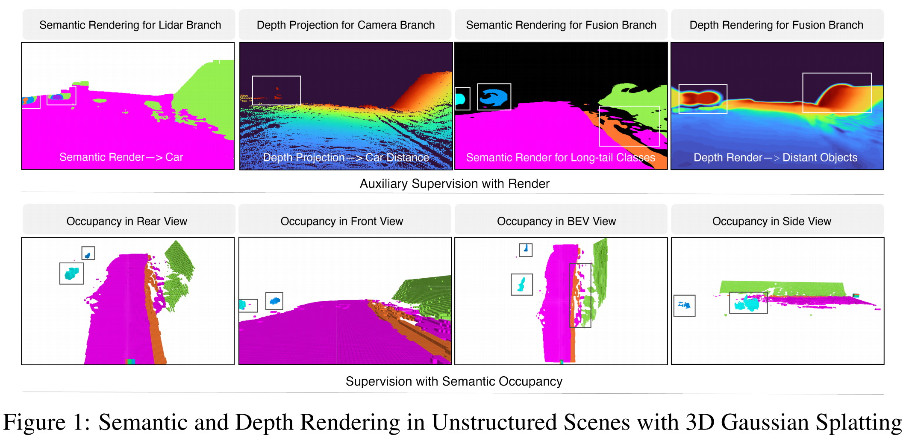
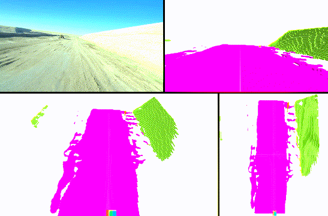
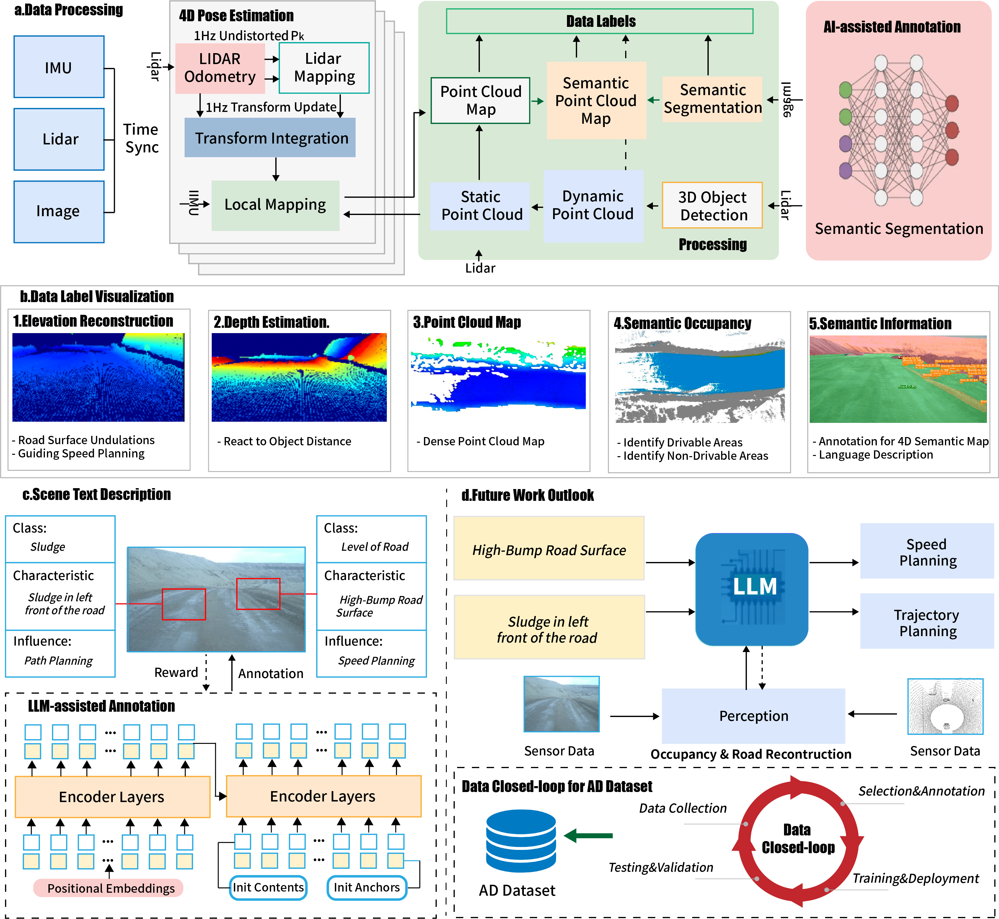

# Scene as Occupancy and Reconstruction: A Comprehensive Dataset for Unstructured Scene Understanding
### [Paper](https://arxiv.org/pdf/2311.12754)  | [Project Page](https://github.com/ruiqi-song/UnScene-AutoDrive) 



> Scene as Occupancy and Reconstruction: A Comprehensive Dataset for Unstructured Scene Understanding

> [Ye Wu](https://github.com/ruiqi-song)*, 
> [Ruiqi Song](https://scholar.google.com/citations?hl=en&user=hMSOTPoAAAAJ&view_op=list_works&sortby=pubdate)\* $\dagger$, 
> [Baiyong Ding](https://github.com/ruiqi-song), 
> [Nanxing Zeng](https://github.com/ruiqi-song), 
> [XinQing Li](https://github.com/ruiqi-song), 
> [Long Chen](https://scholar.google.com.hk/citations?user=fDZNc60AAAAJ&hl=en)$\ddagger$

\* Equal contribution $\dagger$ Project leader $\ddagger$ Corresponding author

Code Contributors: [Ye Wu](https://github.com/ruiqi-song), 
                   [Baiyong Ding](https://github.com/ruiqi-song)
                 

## News
- **[2025/6/10]** Code Release
- **[2025/8/20]** Paper released on [arXiv](https://arxiv.org/abs/2311.12755).
- **[2025/10/26]** UnsOcc is accepted to CoRL 2025!
- **[2025/11/20]** Demo release.

## Demo

### Trained using only video sequences and poses:



## Overview


- We propose a novel 3D semantic occupancy prediction framework that improves the robustness of prediction in unstructured scenes. Bidirectional supervision for cross-modal feature alignment mechanism and detail-aware 3D Gaussian Splatting auxiliary supervision mechanism are proposed to enhance the capability of cross-modal fusion and long-tailed class prediction in unstructured scene, respectively

- Our UnsOcc outperforms the newest and best method L2Occ by 58.7% on UnScenes3D and is the first 3D semantic occupancy prediction work in unstructured scenes.

## Dataset organization
├── Dataset
│   ├── calibs                    %calibration information
│   ├── images                    %synchronized frame image data
│   │   ├──1689903584.278848.jpg  
│   │   ├──...
│   ├── clouds                    %HAP synchronized frame point cloud data
│   │   ├──1689903584.278848.bin
│   │   ├──...
│   ├── occ                       %3d semantic occupancy prediction labels 
│   ├── elevation                 %road elevation labels
│   ├── depths                    %depth labels
│   ├── imagesets                 %training, validation, and test set
│   │   ├──train.txt
│   │   ├──val.txt
│   │   ├──test.txt
│   ├── localmap_clouds           %dense point cloud map 
│   ├── vehicle_infos             %ego poses, speed, acceleration information
│   └── image_caption             %language description

## Dataset Stastic


## Results
# Occupancy baseline


# Depth baseline


## Getting Started

### Installation

Follow detailed instructions in [Installation](docs/installation.md).

### Preparing Dataset

Follow detailed instructions in [Prepare Dataset](docs/prepare_data.md).


### Run

#### 3D Occupancy Prediction

Download model weights [HERE](https://cloud.tsinghua.edu.cn/f/831c104c82a244e9878a/) and put it under out/nuscenes/occ/
```bash
# train
python train.py --py-config config/nuscenes/nuscenes_occ.py --work-dir out/nuscenes/occ_train --depth-metric
# eval
python eval_iou.py --py-config config/nuscenes/nuscenes_occ.py --work-dir out/nuscenes/occ --resume-from out/nuscenes/occ/model_state_dict.pth --occ3d --resolution 0.4 --sem --use-mask --scene-size 4
```

#### Novel Depth Synthesis


Download model weights [HERE](https://github.com/ruiqi-song) and put it under out/nuscenes/novel_depth/
```bash
# train
python train.py --py-config config/nuscenes/nuscenes_novel_depth.py --work-dir out/nuscenes/novel_depth_train --depth-metric
# evak
python eval_novel_depth.py --py-config config/nuscenes/nuscenes_novel_depth.py --work-dir out/nuscenes/novel_depth --resume-from out/nuscenes/novel_depth/model_state_dict.pth
```

### Visualization

Follow detailed instructions in [Visualization](docs/visualization.md).

## Related Projects


Also thanks to these excellent open-sourced repos:
[Co-Occ](https://github.com/Rorisis/Co-Occ/pulls) 


## Citation

If you find this project helpful, please consider citing the following paper:
```
@article{wu2025uns,
    title={UnsOcc: 3D Semantic Occupancy Prediction in Unstructured Scene via Rendering Fusion},
    author={Wu, Ye and Song, Ruiqi and Ding, Baiyong and Zeng, Nanxin and Li, Xinqing and Ai, Yunfeng },
    journal={arXiv preprint arXiv:2311.1275},
    year={2025}
}
```
